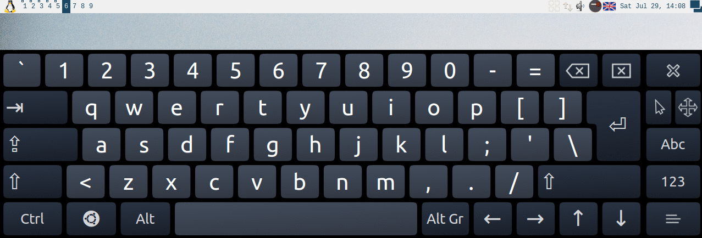

# Keyboard switcher for Awesome WM with additional layouts

## Intro
Usually I use two keyboard layouts on my computer there are English and Russian layouts. But sometimes I need to write something on another language, for example: German.
But adding new keyboard layout was very annoying me. Because I have to press more than one time for changing my keyboard layout from Russian to English.
But with this widget I can configure additional layouts. When I press on buttons on keyboard only my primary layouts will be switching. But when I want to use additional layout, I just click right mouse button on keyboard widget and select one of additional layouts. You can see how it is work in the Screenshot section.

## Installing
Clone this repository to your Awesome WM configuration directory:
```
cd ~/.configs/awesome
git clone https://github.com/echuraev/keyboard_layout
```

## Usage
1. Add call of `keyboard_layout` module to your `rc.init`:
   ```
   local keyboard_layout = require("keyboard_layout")
   ```

2. Create instance of keyboard widget. You can choose between text and graphical
   layout label, see below. Primary and Additional layouts can be set by
   `add_primary_layout` and `add_additional_layout` respectively. And when you
   add all necessary options to `kbdcfg` then you have to call `bind`
   functions. In this call all your settings will apply.

   2.1. Create text label:
   ```
   local kbdcfg = keyboard_layout.kbdcfg({type="tui"})

   kbdcfg.add_primary_layout("English", "US", "us")
   kbdcfg.add_primary_layout("Русский", "RU", "ru")

   kbdcfg.add_additional_layout("Deutsch",  "DE", "de")
   kbdcfg.add_additional_layout("Français", "FR", "fr")
   kbdcfg.bind()
   ```
   2.2. Create graphical label:
   ```
   local kbdcfg = keyboard_layout.kbdcfg({type="gui"})

   kbdcfg.add_primary_layout("English", beautiful.en_layout, "us")
   kbdcfg.add_primary_layout("Русский", beautiful.ru_layout, "ru")

   kbdcfg.add_additional_layout("Deutsch",  beautiful.de_layout, "de")
   kbdcfg.add_additional_layout("Français", beautiful.fr_layout, "fr")
   kbdcfg.bind()
   ```
3. Bind your mouse keys:
   ```
   -- Mouse bindings
   kbdcfg.widget:buttons(
    awful.util.table.join(awful.button({ }, 1, function () kbdcfg.switch_next() end),
                          awful.button({ }, 3, function () kbdcfg.menu:toggle() end))
   )
   ```
4. Bind your keyboard shortcuts:
   ```
   globalkeys = awful.util.table.join(globalkeys,
       -- Shift-Alt to change keyboard layout
       awful.key({"Shift"}, "Alt_L", function () kbdcfg.switch_next() end),
       -- Alt-Shift to change keyboard layout
       awful.key({"Mod1"}, "Shift_L", function () kbdcfg.switch_next() end)
   )
   ```
5. Add widget to your wibar:
   ```
   s.mywibox = awful.wibar({ position = "top", screen = s })

   -- Add widgets to the wibox
   s.mywibox:setup {
       layout = wibox.layout.align.horizontal,
       { -- Left widgets
           -- ...
       },
       { -- Middle widgets
           -- ...
       },
       { -- Right widgets
           -- ...
           kbdcfg.widget,
           -- ...
       },
   }
   ```

## How to use a different layout switch command

By default the widget uses `setxkbmap` command to switch keyboard layouts. The
following parameters allow it to use a non-standard layout switcher, for example
the [Fcitx](https://github.com/fcitx/fcitx) for Chinese/Japanese/Korean input:

```
local kbdcfg = keyboard_layout.kbdcfg({cmd = "fcitx-remote -s", type="tui"})

kbdcfg.add_primary_layout("English",  "us", "fcitx-keyboard-us")
kbdcfg.add_primary_layout("Russian",  "ru", "fcitx-keyboard-ru-ruu")
kbdcfg.add_primary_layout("Japanese", "ja", "mozc")
```

Note, that you should pass a valid input method name to `fcitx-remote`
command. The last layout in the example uses the
[Mozc](https://github.com/google/mozc) as an input method for Japanese input.

## Functions
`switch_next()` - this function switches one primary keyboard layout to the next primary layout.

`bind()` - this function applies all settings to the widget.

`switch_by_name(name)` - this function is mostly used for setting additional
layouts. It gets a layout name (first parameter of `add_xxxx_layout()` of layout
that should be set.

`add_primary_layout(name, label, subcmd)` - this function adds a primary layout to the widget.

`add_additional_layout(name, label, subcmd)` - this function adds additional layout to the widget.

## Screenshots
In the beginning of both screen casts I changed layouts by keyboard shortcats and only primary layouts were switched. After that I showed how additional layouts work.

Usage of gui_layout:


Usage of tui_layout


## Author
Egor Churaev egor.churaev@gmail.com

## Licence
MIT

## Flags icons
Icon with British flag I take from here: https://www.gosquared.com/resources/flag-icons/

